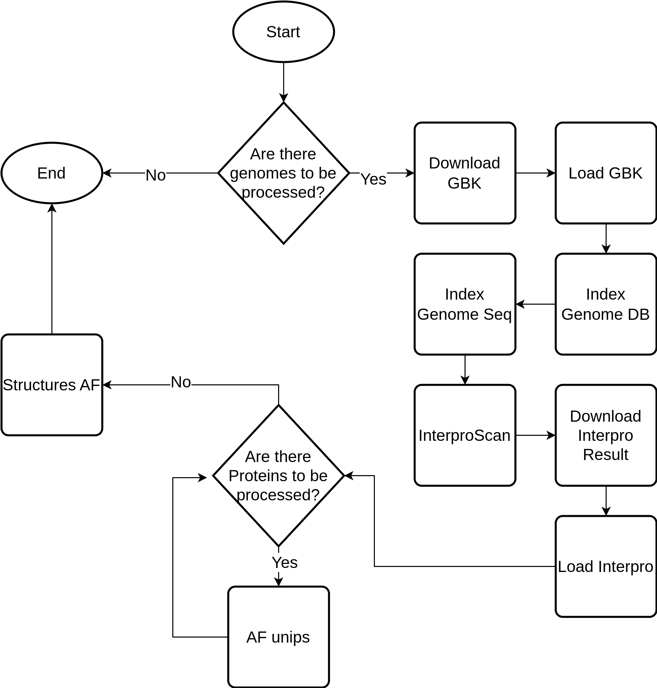

# Target-Parsl Workflow

## Introduction

This workflow goal is to automatize and allow the parallel execution of multiple tasks related to the insertion and analysis of a genome in the TargetPathogen V2 system.

The workflow acts as an external layer to the Django implementation of Target Pathogen. Therefore, the coupled activities are calls to custom Django commands through ``manage.py`` script. The remaining activities are calls to scripts present in [Target Pathogen repository](https://github.com/sndg-arg/targetpathogen).

The Figure below shows an more general view of the workflow. The activities represent the functions present on the ``apps.py`` file.



## Setting up the workflow

The workflow uses the ``configparse`` library. Hence, it reads the parameters from the ``settings.ini`` file in the root folder. The snippet below shows an example of settings.

```INI
[GENERAL]
WorkingDir=/home/rafael/Documentos/GitHub/targetpathogenweb
Monitoring=True
MaxWorkers=8
EnvironmentFile = settings.env
[SSH]
Username=username
Password=123
HostName = cluster.qb.fcen.uba.ar
WorkingDir=/home/rterra
Cores=8
```

Details about the parameters of the *General* section:

* ``WorkingDir`` is the folder containing the whole Target Pathogen v2.
* ``Monitoring`` refers to parsl monitoring system. When set to True, it saves details about the execution on the ``monitoring.db`` file, which can be analyzed using parsl-visualize.
* ``MaxWorkers`` is the number of workers used by parsl.
* ``EnvironmentFile`` contains all the environment variables that need to be set during the execution, such as variables related to DJANGO and python path.

Details about the parameters of the *SSH* section:

* ``Username`` refers to the username used to connect the script to the cluster containing the interproscan. This parameter can be excluded, which causes the code to get the username from the ``SSH_USERNAME`` environment variable (this variable doesn't need to be in the environment file).
* ``Password`` analog to the Username parameter. Can be excluded if the password is saved on ``SSH_PASSWORD`` environment variable.
* ``HostName`` is the cluster's hostname.
* ``WorkingDir`` is the folder where the files will be stored in the cluster.
* ``Cores`` is the number of cores used by tasks in the remote machine.

## Dependencies

In addition to all the libraries used in Target Pathogen V2, the workflow needs the following libraries: parsl, parsl[monitoring], scp, scpClient, paramiko, configparse and gzip. These libraries can be installed through pip, i. e. python -m pip install "library".

Also, all the libraries and Docker images from https://github.com/sndg-arg/targetpathogen.
## Usage

``run_pipeline.py`` is the main script of the workflow. It receives from the standard input a list genomes splitted by a new line.
